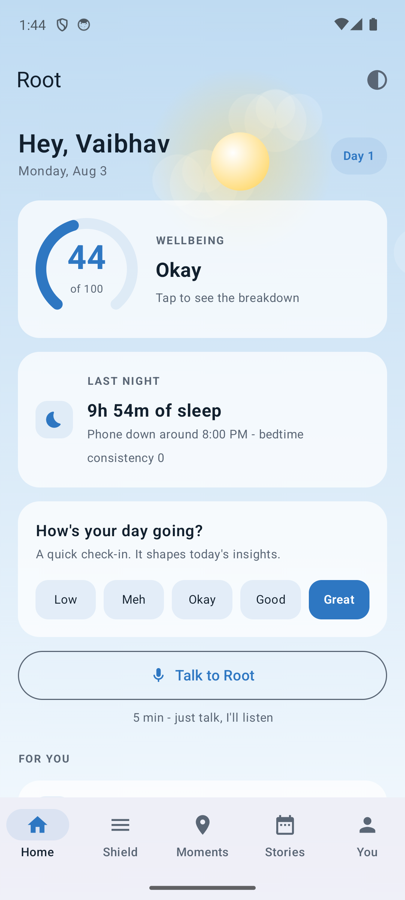
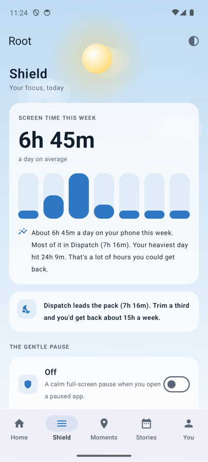
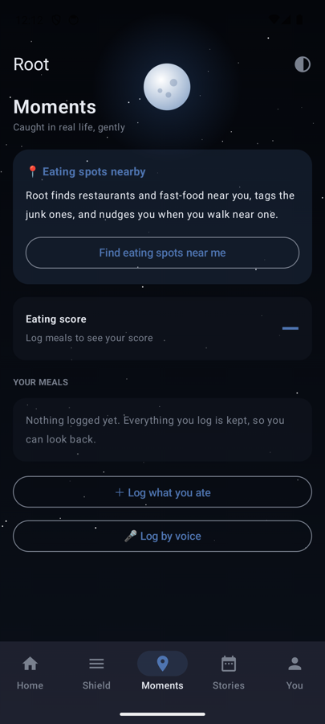
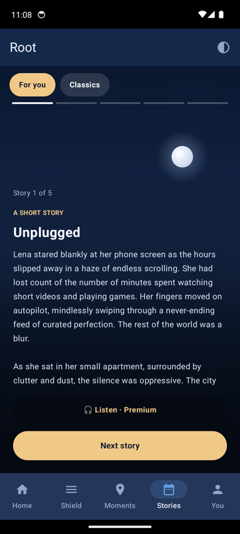
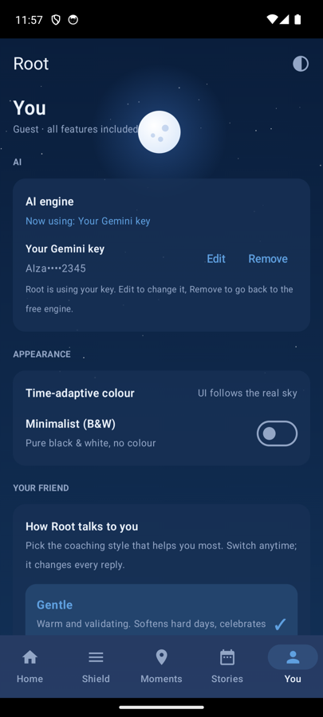
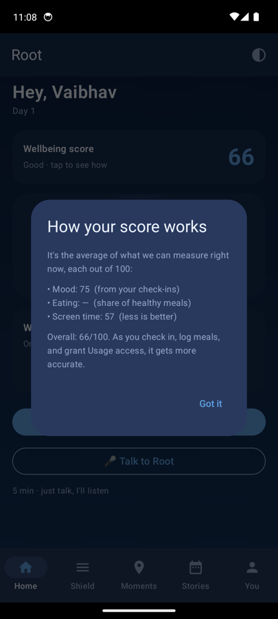

# Root

A friendly Android app that helps youth break the unhealthy digital-lifestyle loop
(irregular sleep, junk food, doomscrolling, low focus, compulsive content) by
catching the moment of decision and interrupting it gently - as a trusted friend,
never a warden. The UI colour follows the real sky (time-adaptive), with a
minimalist black-and-white option.

> Working name. Android first; iOS parked. See `CLAUDE.md` and `docs/` for the full
> product + decisions record. Current build: **v0.2.4**.

## Screens

| Home | Shield | Moments |
|---|---|---|
|  |  |  |
| Greeting, streak, tappable **wellbeing score**, celestial-orb companion, one-tap mood check-in, and entry to a reflection or a voice session. | **Root's read** of your week's screen time, AI "dig deeper" analysis (Screen / Habits / You), mood + meals graphs, and daily screen-time bars. | Nearby eating spots (tagged healthy vs junk), eating score + explainer, and a food log you can add to, log by voice, and browse by day. |

| Stories | You | Score explained |
|---|---|---|
|  |  |  |
| Immersive, finite reads: **For you** (AI-generated) and **Classics** (public-domain). Optional voice narration. Ends on purpose so the scroll doesn't own you. | Appearance (time-adaptive or minimalist B&W), your friend's **personality** (Gentle / Tough-love), the **AI engine** (built-in free, or your own Gemini key), and account. | Tap the Home score to see exactly how it is built: the average of Mood, Eating, and Screen time (each 0-100). |

## What works today
- **Home** - greeting + streak, wellbeing score with a tap-to-explain dialog, animated
  celestial-orb companion, one-tap mood check-in, reflection + voice entry points.
- **AI friend** - short reflection chat and a **voice-only** session. AI generation runs on
  a built-in free engine (Groq `llama-3.1-8b-instant`) by default, or on **your own Gemini
  key** if you add one in You -> AI (more providers planned). Speech-to-text via Groq Whisper;
  a voice reply chain of ElevenLabs -> Google Translate TTS -> Android system TTS. Tone
  follows the chosen personality (Gentle / Tough-love).
- **Shield** - reads real weekly screen time (UsageStatsManager), plain-language "Root's
  read", AI "dig deeper" analyses, mood/meals graphs, and a gentle full-screen interrupt
  (overlay + foreground service) when you open a time-sink app.
- **Moments** - finds nearby restaurants/fast-food via the free OpenStreetMap Overpass API
  and tags each as healthy or junk; eating score + explainer; food log with add, log-by-voice
  (premium), per-day history, and delete.
- **Stories** - AI-generated "For you" stories plus public-domain "Classics", refreshable,
  with optional cloud voice narration; finite by design.
- **You** - AI engine choice (free built-in or your Gemini key), time-adaptive vs minimalist
  theme, personality, account/logout.
- **Accounts + sync** - Supabase auth (email/password or anonymous guest) with row-level
  security; mood/food/reflection rows sync to the cloud so data follows the user.
- **All features are free** - no premium tier, no paywalls, no in-app purchases.

## Stack
Kotlin + Jetpack Compose - Supabase (Postgres + pgvector + Auth + RLS) - free LLM tier
(Groq: chat + Whisper STT) - ElevenLabs / Google Translate TTS with on-device fallback -
OpenStreetMap Overpass (nearby places) - UsageStatsManager + overlay foreground service
(app interrupts). Bring-your-own Gemini key optional. Launch cost target ~$0/month.

> Keys (Groq/ElevenLabs/Supabase anon) currently ship in the APK via BuildConfig. Rotate
> them and route AI + writes through a backend before any public release.

## Quick start
```bash
# 1. Toolchain + SDK (JDK 17, Gradle 8.7, SDK 34): see docs/BUILD_AND_TEST.md
# 2. Run the tests
./gradlew testDebugUnitTest
# 3. Build & install on a device/emulator
./gradlew assembleDebug && adb install -r app/build/outputs/apk/debug/app-debug.apk
```
Secrets go in `local.properties` (gitignored): `GROQ_API_KEY`, `ELEVENLABS_API_KEY`,
`SUPABASE_URL`, `SUPABASE_ANON_KEY`. The app runs offline (demo AI, local-only) if unset.

## Keys and publishing safely
A mobile app is not a secret store: anything compiled into an APK (BuildConfig fields,
strings, "encrypted" blobs) can be extracted with `jadx` / `strings` or by proxying its
HTTPS traffic. So the rule is **don't ship a secret you can't afford to be public**.

- **Safe to ship:** the Supabase **anon** key (a public client key protected by row-level
  security). It stays in the APK.
- **Never ship:** Groq, ElevenLabs, OpenAI, Supabase **service_role** - these are billable /
  privileged.
- **Public build:** `./gradlew assembleRelease -PpublicBuild` strips the paid keys, so the
  APK is safe to attach to a public release (this is what the GitHub release APK is built
  with). In that build, AI needs the user's own Gemini key (You -> AI) or falls back to
  offline demo; voice uses the free no-key TTS.
- **To keep built-in AI while public:** run the thin **backend proxy** in `proxy/` (a free
  Cloudflare Worker) that holds the Groq/ElevenLabs keys as server secrets. Deploy it
  (`proxy/README.md`), set `PROXY_BASE_URL` in `local.properties`, and a `-PpublicBuild` APK
  gets full built-in AI with no keys inside. The app calls the proxy URL (not a secret) and
  the proxy adds the key - so you can also rate-limit, rotate keys without a new app release,
  and cap spend.
- **Rotate leaked keys:** the Groq + ElevenLabs keys were compiled into earlier APKs, so
  rotate them in the Groq / ElevenLabs dashboards even though those release assets were
  deleted.

## Admin (no deployment)
There is no premium tier to manage. To view user activity, use the **Supabase dashboard**
(`user_progress` view) - no server to host. See `docs/ADMIN.md`.

## Deploy
Signed AAB to the Google Play **Internal testing** track first, then promote. Versioning is
wired via `versionCode` (bump every upload) + `versionName`. Runbook: `docs/PLAY_STORE.md`.

## Docs
- `CLAUDE.md` - project brief + rules (read first)
- `docs/SPEC.md` - product spec
- `docs/DECISIONS.md` - decisions + reasoning
- `docs/ROADMAP.md` - what's done + what's next
- `docs/ADMIN.md` - manage users + premium from Supabase (no deployment)
- `docs/SUPABASE.md` - auth + sync + entitlements setup
- `docs/BUILD_AND_TEST.md` - `docs/GITHUB.md` - `docs/PLAY_STORE.md` - runbooks
- `docs/STORE_LISTING.md` - `docs/PRIVACY.md` - store + privacy copy
- `docs/ANALYTICS.md` - owner metrics
- `design/mockup-android.html` - interactive design mockups
